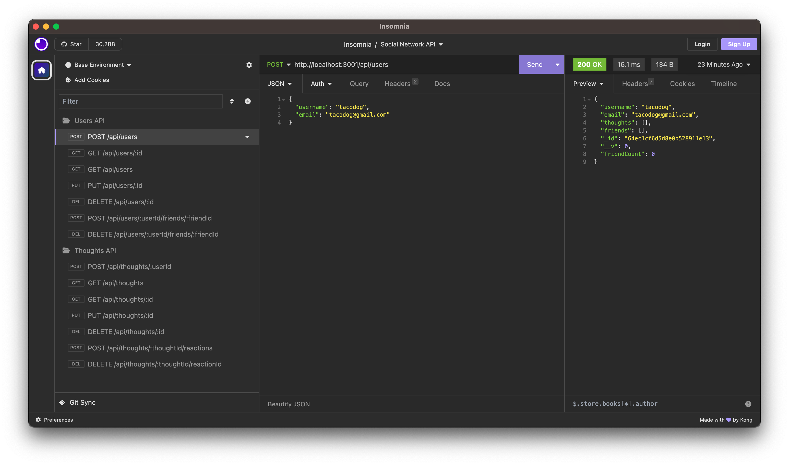

# Social Network API

## Description

This is an API for a social network web application where users can share their thoughts, react to friends’ thoughts, and create a friend list. This project is built using Express.js for routing, a MongoDB database, and the Mongoose ODM. The Javascript date library moment was also used to format timestamps.

## Table of Contents

- [Description](#description)
- [Installation](#installation)
- [Usage](#usage)
- [Contributing](#contributing)
- [Tests](#tests)
- [License](#license)
- [Questions](#questions)

## Installation

To install and use this app, clone this repo and navigate to the root directory. Run `npm i` to install the necessary libraries used to run this app e.g. express, etc. These libraries are specified in the package.json.

## Usage

To run this app locally on your machine, navigate to the project root. Run the command `npm run start` to run the app. If you are actively developing, you can alternatively run `npm run watch` so that every time you save the file you don't need to restart the server (thanks to nodemon).

The testing was done via a tool called Insomnia; see below screenshot of what it looks like to test the APIs.

View the complete video walkthrough of the API being used in Insomnia here at this Dropbox link:
https://www.dropbox.com/scl/fi/ov01u1gmnq7qly25lckb4/social-media-api-walkthrough.mov?rlkey=2dqsv8prpuxmi0nr2wkdy9z38&dl=0

## Contributing

To contribute, please clone or fork this repo and make a pull request for my review.

## Tests

There are currently no unit tests yet for this application.

## License

This application uses the MIT license. Please see
https://mit-license.org/ for more information on this license.

## Questions

You can find me [HERE](https://github.com/mslzbry) on Github.
Feel free to email me at m.slzbry@gmail.com if you have any additional questions.
